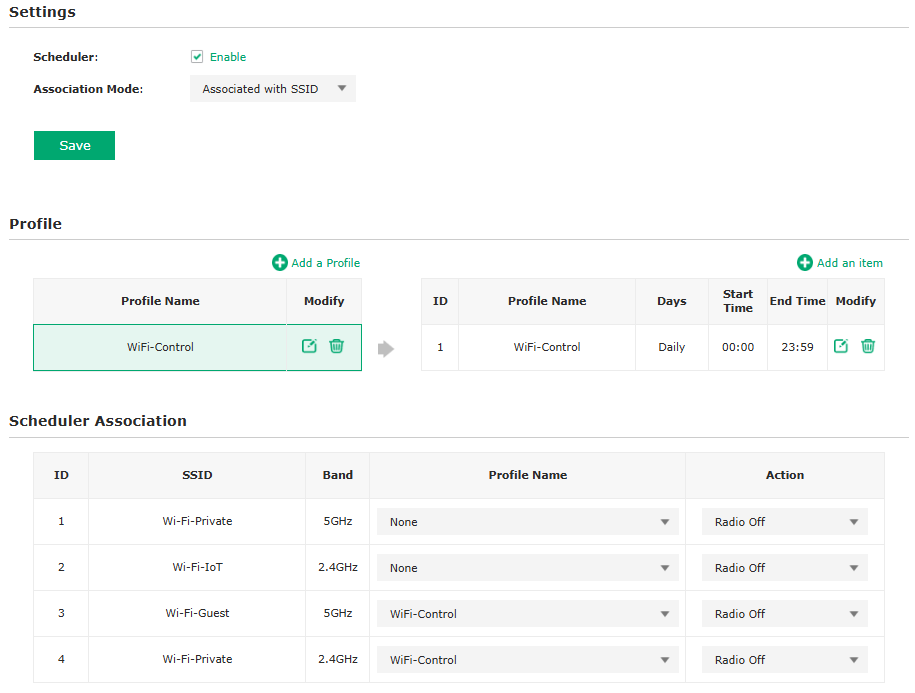

# TP-Link EAP723 Wi-Fi Control 

A Python-based solution to dynamically control Wi-Fi SSIDs on a **TP-Link EAP723** Access Point without requiring an Omada Controller. This project is designed for users who prefer a standalone, lightweight setup for simple private networks.

## Tables Of Contents

- [TP-Link EAP723 Wi-Fi Control](#tp-link-eap723-wi-fi-control)
  - [Tables Of Contents](#tables-of-contents)
  - [Overview](#overview)
  - [Prerequisites](#prerequisites)
  - [Scheduler profile configuration](#scheduler-profile-configuration)
  - [Usage](#usage)
    - [CLI example](#cli-example)
    - [Deployment of the Python Script](#deployment-of-the-python-script)
  - [Home Assistant Configuration](#home-assistant-configuration)
    - [shell-command.yaml](#shell-commandyaml)
    - [scripts.yaml](#scriptsyaml)
    - [configuration.yaml](#configurationyaml)
    - [template.yaml](#templateyaml)
  - [API Testing with Bruno](#api-testing-with-bruno)
  - [Summary](#summary)

## Overview

- **Purpose :** directly control SSID radio states on a TP‑Link EAP723 without deploying an Omada controller.
- **Core idea :** use a single 24/7 scheduler profile associated with all SSIDs, then flip the radio state (on/off) to enable or disable Wi‑Fi.

## Prerequisites

The login script requires only the **hashed password**.  

To obtain it:

1. Open browser developer tools.
2. Go to the **Network** tab and enable **Preserve Log**.  
3. Perform a login attempt and locate the `login` call.  
4. In the **Payload**, copy the value of the `password` attribute.  

This hash is used directly by the script.

## Scheduler profile configuration

Create a single scheduler profile that runs continuously and associate it with all SSIDs you want to control. Then only toggle radio state.

- **Profile setup:**  
  - **Name:** WiFi‑Control  
  - **Schedule:** Daily, **00:00 → 23:59**, 7 days a week  
- **Association:** Link the profile to each SSID and band you intend to control
- **Effect:** With a 24/7 association in place, radio on/off becomes a quick, deterministic switch



## Usage

### CLI example

```bash
python3 eap723_wifi_control.py \
  --host 192.168.1.2 \
  --user "admin" \
  --pass_hash "<your_precomputed_hash>" \
  --target_ssid "Wi-Fi-Guest" \
  --target_band "5GHz" \
  --action "off"
```

### Deployment of the Python Script

Before using the script in Home Assistant, you need to:

1. Copy the Python script (eap723_wifi_control.py) into the same directory as your Home Assistant configuration, typically alongside configuration.yaml.
2. Make the script executable by running the following command on your Home Assistant host:

```shell
chmod +x /config/eap723_wifi_control.py
```

## Home Assistant Configuration

The integration is designed to be **dynamic per specific SSID and Band**. Several configuration files are used :

### shell-command.yaml

Defines the shell command to call the Python script with the required arguments:

```yaml
eap723_wifi_control: "bash -c '/config/eap723_wifi_control.py {{ host }} {{ user }} {{ pass_hash }} {{ target_ssid }} {{ target_band }} {{ state }}'"
```

Arguments :

- `host` : Access Point IP (192.162.1.4)
- `user` : Username (typically admin)
- `pass_hash` : Hashed password
- `target_ssid` : Target SSID name
- `target_band` : Target Band frequency (2.4GHz or 5GHz)
- `state` : Desired state (on or off)

### scripts.yaml

Defines the eap723_wifi_control service that :

- Calls the Python script to enable/disable a specific SSID and Band frequency.
- Updates the associated `input_boolean` for the target SSID/Band Frequency.

```yaml
eap723_wifi_control:
  description: "Control Wi-Fi EAP723 dynamically"
  fields:
    target_ssid:
      description: "Target SSID"
      example: "Wi-Fi-Guest, Wi-Fi-Private"
    target_band:
      description: "Target Band Frequency"
      example: "5GHz, 2.4GHz"
    entity_jocker:
      description: "Input Boolean Entity Jocker"
      example: "wifi_guest_5ghz, wifi_private_2g4hz"
    state:
      description: "Wi-Fi state (on/off)"
      example: "on"
  sequence:
    - service: shell_command.eap723_wifi_control
      data:
        host: !secret host_eap723
        user: "admin"
        pass_hash: !secret pass_hash_eap723
        target_ssid: "{{ target_ssid }}"
        target_band: "{{ target_band }}"
        state: "{{ state }}"
    - service: "input_boolean.turn_{{ state }}" 
      target:
        entity_id: "input_boolean.eap723_{{ entity_jocker }}_status"
  mode: queued
```

This ensures that the Wi-Fi state is not updated if the script fails.
The script runs in mode: `queued` to buffer multiple activation/deactivation requests.

### configuration.yaml

Defines one `input_boolean` per specific SSID and Band frequency.

Each `input_boolean` corresponding to an SSID and band combination functions as a state holder.

- If the script fails, the entity does not incorrectly update its state.
- On restart, Home Assistant restores the last known state from the `input_boolean`.

```yaml
script: !include scripts.yaml
template: !include template.yaml
shell_command: !include shell-command.yaml

#-----------------input boolean-----------------
input_boolean:
  eap723_wi_fi_guest_5ghz_status:
    name: Statut Wi-Fi Guest 5GHz EAP723
    icon: mdi:wifi-marker
  eap723_wi_fi_private_2g4hz_status:
    name: Statut Wi-Fi Private 2G4Hz EAP723
```

### template.yaml

Defines the switch entities for each SSID/Band.
These switches call the `eap723_wifi_control` service from `scripts.yaml` with the correct arguments.

```yaml
- switch:
  - name: "WiFi Guest 5GHz EAP723"
    unique_id: eap723_wifi_guest_5ghz
    state: "{{ is_state('input_boolean.eap723_wi_fi_guest_5ghz_status', 'on') }}"
    turn_on:
      - service: script.eap723_wifi_control
        data:
          target_ssid: "Wi-Fi-Guest"
          target_band: "5GHz"
          entity_jocker: "wi_fi_guest_5ghz"
          state: "on"
    turn_off:
      - service: script.eap723_wifi_control
        data:
          target_ssid: "Wi-Fi-Guest"
          target_band: "5GHz"
          entity_jocker: "wi_fi_guest_5ghz"
          state: "off"
    icon: >-
      
        mdi:wifi-arrow-up
      
        mdi:wifi-arrow-down
      
```

## API Testing with Bruno

A Bruno prototype is available to test API calls and explore additional features based on the same principle, such as rebooting the device (which can also be achieved by toggling PoE on or off).

## Summary

- Offers a lightweight and effective way to control Wi‑Fi radios on TP‑Link EAP723 access points without Omada.
- Python script manages authentication using a precomputed password hash, API scraping, and radio toggle requests.
- Home Assistant integration provides seamless automation, reliable state management via input_boolean, and flexible scheduling.
- Built around a 24/7 scheduler profile associated with all SSIDs, enabling simple on/off control of each SSID/Band.
- Designed to be modular and easily extended to multiple SSIDs and bands within the access point.

If you appreciate this project, please don’t hesitate to ⭐ it and feel free to provide your feedback !


[def]: ./doc/screenshot-EAP723-scheduler-interface.png